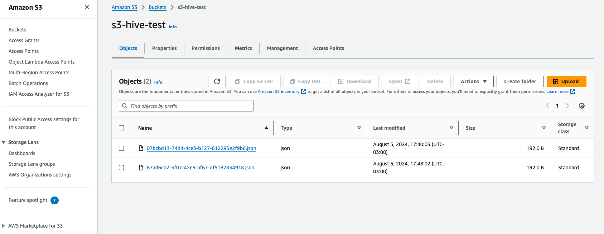

# Gerenciamento de Tarefas com Java, Spring Boot e AWS

Este projeto demonstra a criação de uma aplicação para gerenciamento de tarefas utilizando Spring Boot, MongoDB, AWS S3 e programação reativa com Spring WebFlux para o Teste Prático: Desenvolvedor Java da Hive.

## Tecnologias Utilizadas

- **Java (JDK 17)**: Linguagem de Programação Java para desenvolvimento do backend.
- **Spring Boot (3.3.2)**: Framework Java para desenvolvimento de aplicações web e microserviços.
- **MongoDB**: Banco de dados NoSQL para armazenamento dos dados das tarefas.
- **AWS S3**: Serviço de armazenamento da AWS para salvar arquivos JSON das tarefas.
- **Docker**: Ferramenta para containerização da aplicação.
- **Lombok**: Biblioteca que ajuda a reduzir o código boilerplate.
- **Spring Data MongoDB**: Integração do Spring Framework com o MongoDB.
- **Spring Data WebFlux**: Integração do Spring Framework com a programação reativa.

## Principais Funcionalidades

### Controllers

#### TarefaController

- **@POST /criar-tarefa**: Cria uma nova tarefa e salva no bucket S3.
- **@GET /listar-tarefas**: Lista todas as tarefas.
- **@GET /listar-tarefas/status**: Lista todas as tarefas com um status específico.
- **@PUT /atualizar-tarefa/{id}**: Atualiza uma tarefa existente e salva no bucket S3.
- **@DELETE /deletar-tarefa/{id}**: Deleta uma tarefa pelo ID.

### Services

#### TarefaService

- **criarTarefa(Tarefa tarefa)**: Cria uma nova tarefa, salva no MongoDB e armazena um arquivo JSON no S3.
- **atualizarTarefaPorId(String id, Tarefa tarefa)**: Atualiza uma tarefa existente, salva no MongoDB e armazena um arquivo JSON atualizado no S3.
- **buscarTarefas()**: Lista todas as tarefas.
- **deletarTarefasPorId(String id)**: Deleta uma tarefa pelo ID.
- **buscarTarefasPorStatus(String status)**: Lista todas as tarefas com um status específico.

### Modelos de Domínio

- **Tarefa**: Entidade mapeada para o MongoDB com um ID gerado automaticamente.

### Configuração do MongoDB

Um arquivo de inicialização (`mongo-init.js`) é utilizado para popular o banco de dados MongoDB com dados iniciais.

### Configuração da AWS S3

A integração com o AWS S3 é realizada para salvar arquivos JSON representando as tarefas.

## Configuração do Docker

### Dockerfile

Arquivo utilizado para criar a imagem Docker da aplicação.

```dockerfile
FROM openjdk:17-jdk-slim
VOLUME /tmp
COPY target/hive-test-0.0.1-SNAPSHOT.jar app.jar
ENTRYPOINT ["java","-jar","/app.jar"]
```

### Evidencia nos arquivos no Bucket S3 da AWS


## Desenvolvido por Jeferson Siqueira

- Github: https://github.com/jeferson0306
- LinkedIn: https://www.linkedin.com/in/developerjefersonsiqueira/
